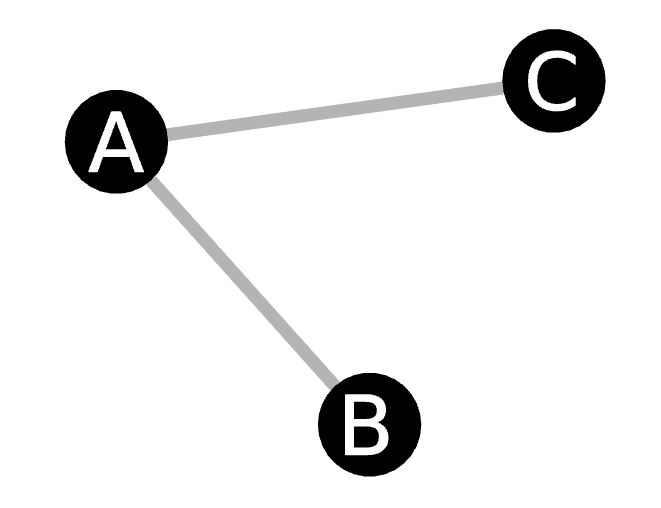
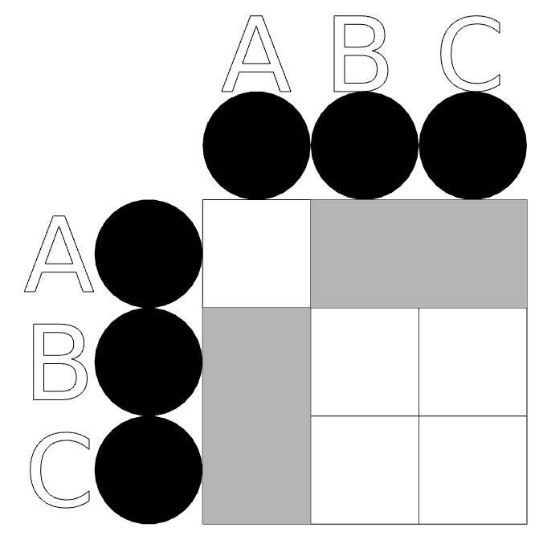
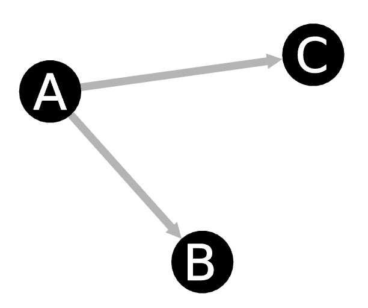

## Introduction


Dans ce cours, nous allons nous itéresser à l'utilisation des graphes à des fins de représentation, d'analyse et de visualisation de données.

## Qu'est-ce qu'un graphe?

Les graphes, aussi appelés réseaux, sont des objets mathématiques permettant de définir à partir d'un ensemble d'entités, un ensemble de relations liant ces entités entre-elles. Différentes appelations en plus du couple entités-relations peuvent être utilisées alternativement comme noeuds-liens ou sommets-arêtes. Certains termes peuvent porter des co-notations selon le domaine considéré, cependant, nous les utiliserons de manière interchangeable par la suite.

### Représentation

De manière générale, un graphe est souvent représenté sous deux formes. Soit celle d'un diagramme relationnel:



Soit celle d'une matrice d'adjacence décrivant ligne par ligne les connexions entre les noeuds:

```
n   A   B   C
A   0   1   1
B   1   0   0
C   1   0   0
```

Cette dernière peut également être dessinée plus proprement:



Bien que les représentations ci-avant montrent le même objet, il est évident que leur lisibilité n'est pas identique. En l'occurence, bien que semblant plus accessible, le diagramme relationnel perd beaucoup de son intérêt dès que le nombre d'éléments considérés devient trop important. Il est alors nécessaire de se replier sur des techniques de visualisations alternatives que nous verrons plus tard.

### Orientation du graphe

Dans certains cas, nous pouvons avir besoin de différencier entre le noeud à la source de la relation de celui la recevant. Nous nous trouvons alors face à un graphe dit orienté. Ces derniers se distinguent de leur homologue non-orientés par l'utilisation de flèches dans les diagramme relationnels:



Ainsi que par une non-symétrie entre les parties droites et gauche de la matrice d'adjacence:

```
n   A   B   C
A   0   1   1
B   0   0   0
C   0   0   0
```

## Attributs d'un graphe

Un graphe possède plusieurs caractéristiques le définissant et le différenciant d'un autre graphe. La plus élémentaire correspond à la manière dont les différentes entités sont reliées ensemble: nous parlons alors de la topologie du graphe.

Un graphe peut également avoir un ensemble de propriétés qui sont soit définies pour le graphe lui-même ou alors pour chacun de ses éléments indépendamment (entités et relations). 

Par exemple, un graphe représentant le réseau autoroutier ayant pour noeuds les différentes villes déservies et pour arêtes les autoroutes les reliants, peut avoir ses arêtes caractérisées par un poids indiquant la distance entre chaque noeud, et même par une seconde mesure indiquant le prix des péages nécessaires pour la réalisation du voyage.
Les villes quant à elles peuvent contenir des informations de localisation géographiques (long., lat., alt.), de taille (surface, nombre d'habitants...), etc.

### Attributs visuels

Bien que certaines variations puissent exister selon les librairies ou outils considérés, certaines des variables visuelles courantes sont presque toujours disponibles:

* Couleur
* Taille
* Position
* Forme
* Rotation
* Label

Jouer avec ces variables nous permet de rendre des visualisations multidimensionnelles dans un simple espace 2D. Par exemple:


## Continuons

Nous pouvons passer à la [suite du cours](./2_graph-creation.md).
