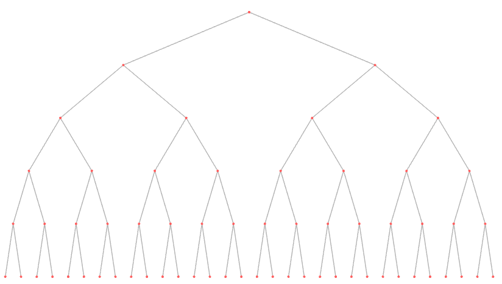

## Introduction 

Dans un fichier tiers exécutable en **Python**, saisissez vos commandes afin de résoudre les différentes question posées ci-après.

N'oubliez pas de mettre tout texte additionnel en commentaire (en utilisant le symbole `#`).

## 1.

Créez un nouveau graphe qui contiendra un arbre binaire de profondeur 5.

## 2.

Réalisez un parcours en profondeur de l'arbre (en partant de la racine) et stockez dans la variable `viewMetric` l'ordre dans lequel les éléments ont été parcourus.

## 3.

Réalisez la même opération avec un parcours en largeur.

## 4.

Grâce à votre mesure indiquant l'ordre, attribuez à chaque noeud une couleur sur une échelle de votre choix (par exemple de rouge à bleu).

