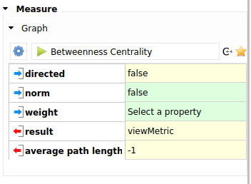

## Utilisation des algorithmes embarqués

L'un des avantages de Tulip est sa grande base d'algorithmes disponible pour réaliser diverses actions, allant de tests topologiques, aux algorithmes de calcul de mesures ou de dessins.

### Algorithmes typés

Afin de classifier les algorithmes, de simplifier les traitements et de limiter les modifications réalisés par chacun d'eux, la majorité des algorithmes est organisée selon le type de transformation réalisée lors de son application. Ainsi, un algorithme de dessin, qui modifie donc la variable `viewLayout`, est un `LayoutAlgorithm`, un algorithme qui changera la taille des sommets est un `SizeAlgorithm`, etc.

Tulip donne accès aux types d'algorithmes suivant:

* BooleanAlgorithm
* ColorAlgorithm
* DoubleAlgorithm
* IntegerAlgorithm
* LayoutAlgorithm
* SizeAlgorithm

Par défaut, les variables visuelles embarquées par Tulip (celles dont le nom débute par `view`) sont utilisées pour récupérer le résultat.

### Algorithmes généraux

Tulip possède également un ensemble d'algorithmes dits "généraux" qui modifient plus d'une variable. Ces derniers peuvent par exemple réarranger spatialement les noeuds et changer leur couleur en même temps. Lorsque l'on fait appel à celles-ci, il est nécessaire d'être particulièrement vigilant quant aux propriétés qui vont être accéder et modifiée.

## Appel aux algorithmes

Nous pouvons récupérer les listes d'algorithmes automatiquement.

```python
tlp.getDoubleAlgorithmPluginsList()
```

```
['Betweenness Centrality', 'Biconnected Component', 'Cluster', 'Connected Component', 'Dag Level', 'Degree', 'Depth', 'Eccentricity', 'Id', 'K-Cores', 'Leaf', 'Link Communities', 'Louvain', 'MCL Clustering', 'Node', 'Page Rank', 'Path Length', 'Random metric', 'Strahler', 'Strength', 'Strength Clustering', 'Strongly Connected Component', 'Welsh & Powell']
```

Une fois que l'algorithme à appliquer est identifié, nous pouvons récupérer la liste des paramètres que celui-ci va utiliser et les valeurs par défaut qui sont utilisées:

```python
tlp.getDefaultPluginParameters('Betweenness Centrality')
```

```
{'result': None, 'directed': False, 'norm': False}
```

Il est important de noter que toutes les valeurs par défaut ne sont pas indiquées tout le temps, certaines valeurs optionnelles ne sont toujours renseignées.



L'appel à l'algorithme est ensuite réalisé tel que suit

```python
params = tlp.getDefaultPluginParameters('Betweenness Centrality')
graph.applyDoubleAlgorithm('Betweenness Centrality', params)
```


## À vous de jouer

C'est maintenant votre tour de vérifier vos acquis en réalisant les [exercices suivants](./5_exercice.md).
